# 供應鏈關係圖

以下圖表呈現「供應鏈環節 → 次領域 → 公司」。點擊節點可開啟對應筆記。

```mermaid
flowchart LR
    STAGE_UP["[[供應鏈-上游|上游]]"] --> CAT01["[[次領域-晶圓代工與先進封裝|晶圓代工與先進封裝]]"]
    STAGE_UP["[[供應鏈-上游|上游]]"] --> CAT02["[[次領域-晶片封測服務|晶片封測服務]]"]
    STAGE_UP["[[供應鏈-上游|上游]]"] --> CAT03["[[次領域-ASIC設計服務_IP|ASIC設計服務_IP]]"]
    STAGE_UP["[[供應鏈-上游|上游]]"] --> CAT04["[[次領域-伺服器遠端管理_傳輸|伺服器遠端管理_傳輸]]"]
    STAGE_MID["[[供應鏈-中游|中游]]"] --> CAT05["[[次領域-散熱管理|散熱管理]]"]
    STAGE_MID["[[供應鏈-中游|中游]]"] --> CAT06["[[次領域-電源供應系統|電源供應系統]]"]
    STAGE_MID["[[供應鏈-中游|中游]]"] --> CAT07["[[次領域-ABF載板_高階PCB|ABF載板_高階PCB]]"]
    STAGE_MID["[[供應鏈-中游|中游]]"] --> CAT08["[[次領域-伺服器滑軌與機殼|伺服器滑軌與機殼]]"]
    STAGE_MID["[[供應鏈-中游|中游]]"] --> CAT09["[[次領域-高速連接器與線束|高速連接器與線束]]"]
    STAGE_DOWN["[[供應鏈-下游|下游]]"] --> CAT10["[[次領域-伺服器ODM_整機櫃組裝|伺服器ODM_整機櫃組裝]]"]
    STAGE_DOWN["[[供應鏈-下游|下游]]"] --> CAT11["[[次領域-品牌伺服器與板卡|品牌伺服器與板卡]]"]
    STAGE_DOWN["[[供應鏈-下游|下游]]"] --> CAT12["[[次領域-邊緣運算_工業AI|邊緣運算_工業AI]]"]
    STAGE_DOWN["[[供應鏈-下游|下游]]"] --> CAT13["[[次領域-高速網路交換器|高速網路交換器]]"]
    CAT01 --> C2330["[[2330 台積電|台積電 2330]]"]
    CAT02 --> C3711["[[3711 日月光投控|日月光投控 3711]]"]
    CAT02 --> C2449["[[2449 京元電子|京元電子 2449]]"]
    CAT03 --> C3661["[[3661 世芯-KY|世芯-KY 3661]]"]
    CAT03 --> C3443["[[3443 創意|創意 3443]]"]
    CAT03 --> C3035["[[3035 智原|智原 3035]]"]
    CAT04 --> C5274["[[5274 信驊|信驊 5274]]"]
    CAT04 --> C5269["[[5269 祥碩|祥碩 5269]]"]
    CAT04 --> C4966["[[4966 譜瑞-KY|譜瑞-KY 4966]]"]
    CAT05 --> C3017["[[3017 奇鋐|奇鋐 3017]]"]
    CAT05 --> C3324["[[3324 雙鴻|雙鴻 3324]]"]
    CAT05 --> C3653["[[3653 健策|健策 3653]]"]
    CAT06 --> C2308["[[2308 台達電|台達電 2308]]"]
    CAT06 --> C2301["[[2301 光寶科|光寶科 2301]]"]
    CAT07 --> C3037["[[3037 欣興|欣興 3037]]"]
    CAT07 --> C8046["[[8046 南電|南電 8046]]"]
    CAT07 --> C2368["[[2368 金像電|金像電 2368]]"]
    CAT07 --> C2383["[[2383 台光電|台光電 2383]]"]
    CAT08 --> C2059["[[2059 川湖|川湖 2059]]"]
    CAT08 --> C8210["[[8210 勤誠|勤誠 8210]]"]
    CAT08 --> C6584["[[6584 南俊國際|南俊國際 6584]]"]
    CAT09 --> C3665["[[3665 貿聯-KY|貿聯-KY 3665]]"]
    CAT09 --> C3533["[[3533 嘉澤|嘉澤 3533]]"]
    CAT09 --> C6290["[[6290 良維|良維 6290]]"]
    CAT10 --> C2317["[[2317 鴻海|鴻海 2317]]"]
    CAT10 --> C2382["[[2382 廣達|廣達 2382]]"]
    CAT10 --> C6669["[[6669 緯穎|緯穎 6669]]"]
    CAT10 --> C3231["[[3231 緯創|緯創 3231]]"]
    CAT10 --> C2356["[[2356 英業達|英業達 2356]]"]
    CAT11 --> C2376["[[2376 技嘉|技嘉 2376]]"]
    CAT11 --> C2357["[[2357 華碩|華碩 2357]]"]
    CAT11 --> C2377["[[2377 微星|微星 2377]]"]
    CAT11 --> C3706["[[3706 神達|神達 3706]]"]
    CAT12 --> C2395["[[2395 研華|研華 2395]]"]
    CAT12 --> C6166["[[6166 凌華|凌華 6166]]"]
    CAT13 --> C2345["[[2345 智邦|智邦 2345]]"]
```

## 跨次領域關係

- [[次領域-晶圓代工與先進封裝]]：上游 [[次領域-ASIC設計服務_IP]]；下游 [[次領域-晶片封測服務]]、[[次領域-ABF載板_高階PCB]]
- [[次領域-晶片封測服務]]：上游 [[次領域-晶圓代工與先進封裝]]、[[次領域-ASIC設計服務_IP]]；下游 [[次領域-ABF載板_高階PCB]]、[[次領域-伺服器ODM_整機櫃組裝]]
- [[次領域-ASIC設計服務_IP]]：上游 無（本研究範圍的邊界）；下游 [[次領域-晶圓代工與先進封裝]]、[[次領域-晶片封測服務]]
- [[次領域-伺服器遠端管理_傳輸]]：上游 [[次領域-晶圓代工與先進封裝]]；下游 [[次領域-ABF載板_高階PCB]]、[[次領域-伺服器ODM_整機櫃組裝]]、[[次領域-品牌伺服器與板卡]]
- [[次領域-散熱管理]]：上游 無（本研究範圍的邊界）；下游 [[次領域-伺服器ODM_整機櫃組裝]]、[[次領域-品牌伺服器與板卡]]
- [[次領域-電源供應系統]]：上游 無（本研究範圍的邊界）；下游 [[次領域-伺服器ODM_整機櫃組裝]]、[[次領域-品牌伺服器與板卡]]、[[次領域-邊緣運算_工業AI]]
- [[次領域-ABF載板_高階PCB]]：上游 [[次領域-晶圓代工與先進封裝]]、[[次領域-晶片封測服務]]、[[次領域-伺服器遠端管理_傳輸]]；下游 [[次領域-伺服器ODM_整機櫃組裝]]、[[次領域-品牌伺服器與板卡]]、[[次領域-高速網路交換器]]
- [[次領域-伺服器滑軌與機殼]]：上游 無（本研究範圍的邊界）；下游 [[次領域-伺服器ODM_整機櫃組裝]]、[[次領域-品牌伺服器與板卡]]
- [[次領域-高速連接器與線束]]：上游 無（本研究範圍的邊界）；下游 [[次領域-伺服器ODM_整機櫃組裝]]、[[次領域-品牌伺服器與板卡]]、[[次領域-高速網路交換器]]
- [[次領域-伺服器ODM_整機櫃組裝]]：上游 [[次領域-散熱管理]]、[[次領域-電源供應系統]]、[[次領域-ABF載板_高階PCB]]、[[次領域-伺服器滑軌與機殼]]、[[次領域-高速連接器與線束]]；下游 無（本研究範圍的邊界）
- [[次領域-品牌伺服器與板卡]]：上游 [[次領域-散熱管理]]、[[次領域-電源供應系統]]、[[次領域-ABF載板_高階PCB]]、[[次領域-伺服器滑軌與機殼]]、[[次領域-高速連接器與線束]]；下游 無（本研究範圍的邊界）
- [[次領域-邊緣運算_工業AI]]：上游 [[次領域-電源供應系統]]、[[次領域-ABF載板_高階PCB]]；下游 無（本研究範圍的邊界）
- [[次領域-高速網路交換器]]：上游 [[次領域-ABF載板_高階PCB]]、[[次領域-高速連接器與線束]]；下游 無（本研究範圍的邊界）

> [!warning]
> 本圖是產業結構圖，不是已驗證的公司供貨關係圖。

返回 [[AI供應鏈投資研究]]。
